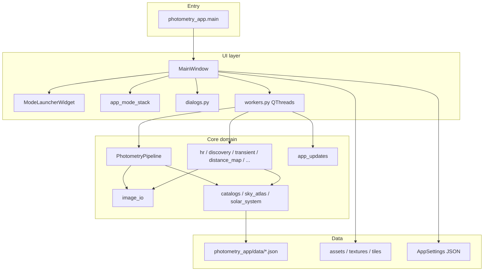

# Citizen Astronomy (CAst) — Codebase Map

Detailed, organized map of the Photometry / Citizen Astronomy desktop application.
Last aligned with the repository layout for **CAst 0.1.1-alpha.1**.

---

## Table of contents

1. [Product snapshot](#1-product-snapshot)
2. [Architecture overview](#2-architecture-overview)
3. [Repository layout](#3-repository-layout)
4. [Entry points and bootstrap](#4-entry-points-and-bootstrap)
5. [Identity, versioning, and paths](#5-identity-versioning-and-paths)
6. [Domain models](#6-domain-models)
7. [Settings and persistence](#7-settings-and-persistence)
8. [Application modes](#8-application-modes)
9. [Core package (`photometry_app/core/`)](#9-core-package-photometry_appcore)
10. [UI package (`photometry_app/ui/`)](#10-ui-package-photometry_appui)
11. [Workers and concurrency](#11-workers-and-concurrency)
12. [Bundled data and assets](#12-bundled-data-and-assets)
13. [Image I/O and display](#13-image-io-and-display)
14. [External services and APIs](#14-external-services-and-apis)
15. [Packaging, installers, and in-app updates](#15-packaging-installers-and-in-app-updates)
16. [Scripts](#16-scripts)
17. [Tests](#17-tests)
18. [User documentation](#18-user-documentation)
19. [Runtime directories and environment](#19-runtime-directories-and-environment)
20. [Dependency surface](#20-dependency-surface)
21. [Size landmarks and ownership notes](#21-size-landmarks-and-ownership-notes)
22. [Quick navigation index](#22-quick-navigation-index)

---

## 1. Product snapshot

| Item | Value |
|------|--------|
| Product name | Citizen Astronomy (CAst) |
| Package name | `citizen-photometry` (`pyproject.toml`) |
| Python package | `photometry_app` |
| Platform | Windows desktop (PySide6 / Qt) |
| License | CC BY-NC-ND 4.0 |
| GitHub | `OgetayKayali/citizen-astronomy` |
| Status | Alpha review |

**What it does:** Takes folders of astronomical images (primarily FITS / XISF) and provides guided science workflows (differential photometry, moving-object discovery, HR diagrams, transient search) plus exploratory tools (Sky Atlas, Sky Explorer, Distance Map, Deep Stack, Observation Deck).

---

## 2. Architecture overview



**Layering rules**

| Layer | Responsibility |
|-------|----------------|
| `photometry_app/main.py` | Process bootstrap, CLI smokes, Qt app, crash logging |
| `photometry_app/ui/` | Widgets, menus, mode panels, dialogs, QThread workers |
| `photometry_app/core/` | Science algorithms, I/O, catalogs, pipelines, update contract |
| `photometry_app/data/` | Packaged JSON catalogs / overlays |
| `packaging/` | Freeze, installer, smoke fixtures, GitHub publish |
| `scripts/` | Dev benchmarks, asset builders, diagnostics |
| `tests/` | Pytest coverage mirroring core/UI concerns |

**Central fact:** Almost all mode UI lives inside `ui/main_window.py` (~89k lines). Mode-specific *science* lives in `core/`. Background work is almost always a `QThread` in `ui/workers.py`, sometimes nesting process/thread pools.

---

## 3. Repository layout

### Top-level directories

| Path | Purpose |
|------|---------|
| `photometry_app/` | Application package (core + UI + data) |
| `tests/` | Pytest suite (~65 modules) |
| `scripts/` | Dev/ops CLIs (tiles, benchmarks, smokes) |
| `packaging/` | PyInstaller hooks, Inno ISS, fixtures, publish scripts, alpha docs |
| `guides/` | End-user mode guides + screenshots |
| `assets/` | App icon, mode-launcher art, optional SPICE docs / moon tiles |
| `textures/` | Source textures for Sky View (MW, constellations, Moon) |
| `docs/` | Small public figures (e.g. synthetic-tracking comparison plots) |
| `images/` | Product / marketing screenshots |
| `.cursor/` | Cursor project rules (local tooling) |

### Top-level files

| Path | Purpose |
|------|---------|
| `README.md` | Product overview for GitHub |
| `CODEBASE_MAP.md` | This map |
| `CONTRIBUTING.md` | Contribution / copyright policy |
| `LICENSE` | CC BY-NC-ND 4.0 |
| `build.md` | Windows EXE + Inno build guide |
| `pyproject.toml` | Package metadata, deps, `citizen-photometry` console script |
| `CitizenAstronomyAlphaReview.spec` | Canonical PyInstaller one-folder release |
| `CitizenPhotometryDebug.spec` | Debug/console PyInstaller build |
| `.gitignore` | Caches, large assets, `_tmp_*`, packaging dist, internal docs |
| `.photometry-settings.json` | Local settings snapshot (developer machine) |
| `script.py` | Ad-hoc HR / catalog debug helper (not a product entry) |

**Ephemeral / generated (normally gitignored):** `_tmp_*`, `_tmp_alpha_review_dist/`, `_tmp_alpha_review_build/`, `packaging/dist/`, `.photometry-cache/`, large tile trees under `assets/` / `textures/`.

---

## 4. Entry points and bootstrap

### Primary entry

| Kind | Location |
|------|----------|
| Module | `python -m photometry_app.main` |
| Console script | `citizen-photometry` → `photometry_app.main:main` (`pyproject.toml`) |
| Frozen EXE | `CitizenAstronomyAlphaReview.exe` (PyInstaller COLLECT folder) |

### `main()` sequence (`photometry_app/main.py`)

1. `multiprocessing.freeze_support()` (PyInstaller worker re-entry safety).
2. Parse smoke CLI flags (see below); if set, run smoke and exit.
3. `QCoreApplication.setAttribute(AA_ShareOpenGLContexts)` (Sky View GL + WebEngine location map).
4. `cleanup_stale_discovery_temp_cache()`.
5. Set Windows AppUserModelID (`CitizenAstronomy.CAst`).
6. Create `QApplication`, Fusion style, icon, version metadata.
7. Construct `MainWindow`, `showMaximized()`, `app.exec()`.
8. On failure: write `%LOCALAPPDATA%\CitizenAstronomy\startup-error.log` and show a critical `QMessageBox`.

### CLI smoke flags (same EXE / module)

| Flag | Behavior |
|------|----------|
| `--qt-image-format-smoke` | Decode embedded TIFF-LZW via Qt; write JSON result |
| `--packaged-format-smoke` | Exercise FITS/XISF/PNG/WebP fixtures + Qt TIFF |
| `--packaged-format-smoke-fixtures` | Fixture directory (default `packaging/fixtures`) |
| `--packaged-format-smoke-output` | Result JSON path |
| `--about-dialog-smoke` | Construct About `QMessageBox` text path |

---

## 5. Identity, versioning, and paths

**File:** `photometry_app/app_metadata.py`

| Constant | Role |
|----------|------|
| `APP_DISPLAY_NAME` | `Citizen Astronomy (CAst)` |
| `APP_WINDOW_TITLE_NAME` | `Citizen Astronomy` |
| `APP_USER_MODEL_ID` | `CitizenAstronomy.CAst` |
| `APP_VERSION` | `0.1.1-alpha.4` (runtime / About / updates) |
| `APP_UPDATE_CHANNEL` | `alpha` |
| `APP_UPDATE_GITHUB_REPOSITORY` | `OgetayKayali/citizen-astronomy` |
| `APP_UPDATE_MANIFEST_ASSET_NAME` | Legacy bootstrap manifest (`CitizenAstronomy-update.json`) |

| Helper | Behavior |
|--------|----------|
| `application_root_path()` | `_MEIPASS` when frozen, else repo root |
| `application_install_path()` | EXE directory when frozen, else repo root |
| `application_icon_path()` | First existing icon under `assets/` |

**Note:** `pyproject.toml` version is `0.1.1a4` (PEP 440); runtime branding uses the hyphenated alpha string above.

---

## 6. Domain models

**File:** `photometry_app/core/models.py`

### Enums

| Enum | Values / role |
|------|----------------|
| `AppMode` | Nine modes (see [§8](#8-application-modes)) |
| `WcsStatus` | Plate-solve / WCS presence classification for scanned files |
| `VariableStarLimitMode` | Caps how many variables enter processing |
| `VariableStarDesignationFamily` | VSX designation family filters |
| `PhotometryApertureMode` | Fixed pixels vs FWHM-scaled apertures |
| `ObjectPhotometryMode` | Per-object photometry strategy |
| `RecenterMode` | Source recentering policy |
| `ManualSourceRole` | Target / comparison / check roles for manual sources |

### Key dataclasses

| Type | Role |
|------|------|
| `ObservationMetadata` | Header-derived observation fields |
| `FileScanResult` | One file’s scan outcome |
| `ObjectScanSummary` | Per-object (folder) scan summary |
| `ScanReport` | Full workspace scan |
| `SolvedField` / `PlateSolveResult` | WCS / solve results |
| `CatalogStar` / `FieldCatalog` | Catalog rows for a field |
| `PhotometryMeasurement` | Single aperture measurement |
| `ScienceObservation` | Rich observation record for exports |
| `ManualSourceConfig` / `ManualPhotometryConfig` | Manual photometry setup |
| `AperturePreset` | Named aperture geometry |
| `LightCurvePoint` / `LightCurveSeries` | Differential light-curve data |
| `ProcessingReport` | Full differential processing output |
| `VariableSelectionPreview` | Preview before full process |
| `RunHistoryEntry` | Cached run history row |

---

## 7. Settings and persistence

**File:** `photometry_app/core/settings.py`

### Types

| Type | Role |
|------|------|
| `AppSettings` | Master settings dataclass (hundreds of fields) |
| `ObservingSitePreset` | Named lat/lon/elevation site |
| `SkyAtlasCustomOverlayRecord` | One cached custom overlay |
| `SkyAtlasCustomOverlaySurvey` | Named survey grouping overlays |

### Persistence locations

| Store | Typical path |
|-------|----------------|
| Settings | `%LOCALAPPDATA%\CitizenAstronomy\settings.json` (also project `.photometry-settings.json` for some workflows) |
| UI state | `%LOCALAPPDATA%\CitizenAstronomy\state.json` |
| Science cache | Configurable `cache_dir` (often under LocalAppData or project) |

### Settings domains (non-exhaustive but complete by concern)

| Domain | Examples |
|--------|----------|
| Astrometry | `astrometry_api_key`, solve hints |
| Photometry apertures | radii, FWHM scales, `photometry_aperture_mode` |
| Variable selection | limit mode/value, designation filters |
| Parallelism | `shared_parallel_workers`, photometry / period / literature / comparison-fit / asteroid / astrostack workers |
| SNR binning | period fractions, target SNR, sigma clip, dataset mode |
| Comparison-fit | stop match index, EB tolerance, fallback pools |
| Asteroid discovery | SNR gates, detector mode, streak params, synthetic sweep grid |
| Synthetic tracking | advanced options flag |
| Calibration paths | bias / dark / flat |
| HR diagram | source caps, plot styling, motion-group presets, splitter sizes |
| Sky Explorer | SIMBAD radius, Gaia mag caps, marker styling, splitter sizes |
| Sky Atlas / View | display toggles, overlays, observing site, Milky Way / Moon options |
| Themes | built-in dark themes + custom theme editing |
| Export | AAVSO / scientific PDF DPI / paper size |
| UI splitters | per-mode saved splitter sizes |

Worker count fields of `0` typically mean “auto” via `resolve_*` helpers in `settings.py`.

---

## 8. Application modes

### Enum (`AppMode`)

| Value | Launcher title | Menu / notes |
|-------|----------------|--------------|
| `differential_photometry` | Differential Photometry | Science card |
| `asteroid_comet_detection` | Asteroid / Comet Detection | Science card |
| `transient_finder` | Transient Finder | Science card |
| `sky_view` | Sky Atlas | Explore card |
| `sky_explorer` | Sky Explorer | Explore card |
| `hr_diagram` | HR Diagram | Explore card |
| `distance_map` | Distance Map | Explore card |
| `astrostack` | Deep Stack | Explore card |
| `astro_tools` | Observation Deck | **Menu only** — not on launcher cards |

### Mode switch flow

1. `ModeLauncherWidget.mode_selected` **or** mode menu `QAction`
2. `_handle_mode_launcher_selection` / `_handle_app_mode_changed` (`main_window.py`)
3. Persist `AppSettings.app_mode`
4. `_apply_app_mode` — swaps `_app_mode_stack` widget, retitles window, updates menus/status

### Shell stacking

| Widget | Role |
|--------|------|
| `_central_shell` (`QStackedWidget`) | Mode launcher **vs** main app shell |
| `_app_mode_stack` | One panel per `AppMode` |

### Mode ownership map

| Mode | UI construction | Core modules | Primary workers |
|------|-----------------|--------------|-----------------|
| Differential Photometry | Differential panel in `main_window` + `light_curve_widget` | `pipeline`, `photometry`, `matching`, `scanner`, `wcs`, `local_wcs`, `catalogs`, `catalog_filters`, `exporters`, `plotting`, `snr_binning`, `period_tasks`, `error_calculations`, `calibration` | `ScanWorker`, `ProcessWorker`, `PreviewWorker`, period / literature / comparison-fit / discover-sources / SNR / export workers |
| Asteroid / Comet | Asteroid panel + many `dialogs.py` SSO dialogs | `solar_system`, `discovery`, `alignment`, `synthetic_tracking`, `array_backend`, `calibration` | `SolarSystemDetectionWorker`, `Asteroid*` workers, blink/image preload, calibration |
| Transient Finder | Transient panel | `transient`, `candidate_training` | `TransientSearchWorker` |
| Deep Stack (`ASTROSTACK`) | Astrostack panel | `alignment`, `animation_export`, `astrostack_presets`, `astrostack_metrics` | Alignment / export paths + shared workers |
| HR Diagram | HR panel + `hr_plot_widget` | `hr_diagram`, `hr_motion_groups` | `HrPrepareWorker`, `HrStarDetailsWorker` |
| Sky Atlas (`SKY_VIEW`) | Sky View panel + GL/moon/star modules | `sky_atlas*`, `milky_way_*` | `SkyAtlasCustomOverlayImportWorker`; async inside GL/moon |
| Sky Explorer | Explorer panel | `sky_explorer`, `survey_images`, `catalogs` | `SkyExplorerWorker`, `SkyExplorerSurveyWorker`, `SkyExplorerDetectWorker` |
| Distance Map | `distance_map_view.DistanceMapPanel` | `distance_map`, `distance_map_display`, `distance_map_clusters` | `DistanceMapWorker` |
| Observation Deck | `astro_tools_panel.AstroToolsPanel` | `observation_map` | `ObservationMapScanWorker` (panel-local) |

### Launcher card assets (`assets/mode_launcher/`)

| File | Mode |
|------|------|
| `differential_photometry.jpg` | Differential |
| `asteroid.gif` | Asteroid / Comet |
| `Transient.gif` | Transient Finder |
| `sky_atlas.jpg` | Sky Atlas |
| `Sky_Explorer.png` | Sky Explorer |
| `hr_diagram.png` | HR Diagram |
| `distance_map.png` | Distance Map |
| `astrostack.gif` | Deep Stack |

---

## 9. Core package (`photometry_app/core/`)

### 9.1 Models, settings, packaging smoke

| Module | Role |
|--------|------|
| `__init__.py` | Package marker |
| `models.py` | Shared enums / dataclasses |
| `settings.py` | `AppSettings` load/save + resolvers |
| `packaged_format_smoke.py` | Frozen format smoke + About dialog smoke |
| `qt_image_formats.py` | Query Qt image plugin support |
| `qt_image_format_smoke.py` | Embedded TIFF-LZW Qt decode smoke |
| `app_updates.py` | Velopack GitHub alpha check/download/apply adapter |
| `benchmarking.py` | Optional timing recorder |

### 9.2 Image I/O, scan, WCS, alignment

| Module | Primary API | Role |
|--------|-------------|------|
| `image_io.py` | `read_*`, `write_fits_copy`, `SUPPORTED_IMAGE_SUFFIXES` | Science image read/write |
| `scanner.py` | `scan_fits_tree`, `inspect_fits_file` | Folder tree scan + metadata |
| `wcs.py` | `AstrometryNetClient`, `validate_wcs`, `extract_solved_field` | Online plate solve |
| `local_wcs.py` | `solve_wcs_from_metadata_and_gaia` | Offline/local WCS seed + Gaia |
| `alignment.py` | `align_wcs_image_sequence` | WCS/affine sequence alignment |

### 9.3 Differential photometry pipeline

| Module | Primary API | Role |
|--------|-------------|------|
| `pipeline.py` | `PhotometryPipeline` | Orchestrates scan → process → export → cache |
| `photometry.py` | `measure_targets`, `measure_manual_sources` | Aperture photometry (photutils) |
| `matching.py` | Reference selection, differential mags, series build | Comparison-star logic |
| `error_calculations.py` | Flux / mag / ensemble / scintillation errors | Uncertainties |
| `catalog_filters.py` | Variable-star filters | Selection gates |
| `catalogs.py` | `CatalogService`, cone search, literature period | VizieR / Simbad / VSX / exoplanet archive |
| `snr_binning.py` | `process_snr_binning_task` | SNR-aware time binning |
| `period_tasks.py` | Lomb-Scargle period search tasks | Process-pool friendly |
| `plotting.py` | Annotated display + light-curve plots + fit helpers | Rendering math |
| `exporters.py` | CSV/JSON/AAVSO/plots/GIF | Science exports |
| `calibration.py` | `calibrate_image_sequence` | Bias/dark/flat reduction |

**`PhotometryPipeline` public surface**

| Group | Methods |
|-------|---------|
| Scan / settings | `scan_workspace`, `load_settings`, `save_settings` |
| Process | `preview_variable_selection`, `process_object` |
| Export | `export_results`, `preview_aavso_export` |
| Cache / history | `clear_catalog_cache`, `clear_object_catalog_cache`, `load_run_history`, `load_cached_processing_report`, `save_cached_processing_report` |

### 9.4 Asteroid / SSO / discovery / synthetic tracking

| Module | Primary API | Role |
|--------|-------------|------|
| `solar_system.py` | Known SSO detect, SkyBoT / Horizons / Miriade / SBDB | Ephemerides & known objects |
| `discovery.py` | `discover_unmatched_moving_candidates`, recovery, residual debug | Unknown mover discovery |
| `synthetic_tracking.py` | `build_synthetic_tracked_stack` | Shift-and-stack on motion |
| `array_backend.py` | NumPy / optional CuPy backend | GPU path for tracking |
| `discovery_benchmark.py` | `run_discovery_benchmark` | Profiling harness |
| `candidate_training.py` | Feature DB / sklearn helpers | Optional ML labeling aid |

### 9.5 Transient Finder

| Module | Primary API | Role |
|--------|-------------|------|
| `transient.py` | `search_transients_in_folder`, `TransientCandidate` | Stationary variability search |

### 9.6 HR Diagram

| Module | Primary API | Role |
|--------|-------------|------|
| `hr_diagram.py` | `measure_hr_sources`, working table | CMD / Gaia photometry match |
| `hr_motion_groups.py` | `find_common_motion_group` | Proper-motion clustering |

### 9.7 Sky Explorer & surveys

| Module | Primary API | Role |
|--------|-------------|------|
| `sky_explorer.py` | `explore_sky_image`, object-type defs | Field object identification |
| `survey_images.py` | `fetch_survey_image` (hips2fits) | Survey cutouts |

### 9.8 Distance Map

| Module | Primary API | Role |
|--------|-------------|------|
| `distance_map.py` | `build_distance_map` | Gaia 3D distance construction |
| `distance_map_display.py` | Display prep + GC catalog | Visualization models |
| `distance_map_clusters.py` | `find_distance_map_cluster` | 3D clustering |

### 9.9 Deep Stack helpers

| Module | Role |
|--------|------|
| `astrostack_presets.py` | Overlay/crop preset serialize |
| `astrostack_metrics.py` | ROI signal/noise metrics |
| `animation_export.py` | Streaming GIF/MP4 writers |

### 9.10 Observation Deck

| Module | Role |
|--------|------|
| `observation_map.py` | Observation coverage / contribution map data |

### 9.11 Sky Atlas & Milky Way

| Module | Role |
|--------|------|
| `sky_atlas.py` | Assemble all-sky catalogs / search |
| `sky_atlas_catalog_storage.py` | On-disk Hipparcos/star catalog cache |
| `sky_atlas_custom_overlay.py` | Import/tone/feather custom overlays |
| `sky_atlas_survey_storage.py` | Multi-survey overlay storage layout |
| `milky_way_assets.py` | Tile pyramid resolver, UV↔sky mapping |
| `milky_way_mask.py` | Transparency mask from RGB |
| `milky_way_tile_generator.py` | Offline tile pyramid builder |
| `milky_way_tile_format_benchmark.py` | Tile encode/decode benchmarks |

---

## 10. UI package (`photometry_app/ui/`)

### 10.1 Shell and mode launcher

| Module | Role |
|--------|------|
| `__init__.py` | Package marker |
| `main_window.py` | Monolithic `MainWindow` — menus, all mode panels, glue |
| `mode_launcher.py` | Home screen cards (`SCIENCE_WORKFLOW_ENTRIES` + `EXPLORE_LEARN_ENTRIES`) |

**Important `main_window` panel factories**

| Method | Mode |
|--------|------|
| Differential panel (constructed in `__init__`) | Differential Photometry |
| `_create_hr_diagram_panel` | HR Diagram |
| `_create_asteroid_detection_panel` | Asteroid / Comet |
| `_create_astrostack_panel` | Deep Stack |
| `_create_transient_finder_panel` | Transient Finder |
| `_create_sky_view_panel` | Sky Atlas |
| `_create_sky_explorer_panel` | Sky Explorer |
| `_create_distance_map_panel` | Distance Map |
| `_create_astro_tools_panel` | Observation Deck |

### 10.2 Shared widgets

| Module | Types | Role |
|--------|-------|------|
| `image_view.py` | `AnnotatedImageView`, overlay dataclasses | Shared annotated canvas |
| `light_curve_widget.py` | `LightCurvePlotWidget` | Differential LC plot |
| `hr_plot_widget.py` | `HrDiagramPlotWidget` | HR plot |
| `curves_widget.py` | Histogram / curves editor | Stretch editing |
| `levels_strip.py` / `levels_dialog.py` | Compact / dialog levels UI | Display stretch |
| `differential_label_dialog.py` | Quick labels | Differential |
| `moving_object_label_dialog.py` | Quick labels | Asteroid |
| `transient_label_dialog.py` | Quick labels | Transient |

**`AnnotatedImageView` overlay kinds:** circle, text, rectangle, ellipse, cross, target, plot; plus equatorial grid, selection ROI, motion vectors, chart/info panels, title/location/band decorations.

### 10.3 Dialogs (`dialogs.py`)

Large dialog suite (~11k lines). Major public dialogs:

| Dialog | Concern |
|--------|---------|
| `SettingsDialog` | Global settings |
| `ThemeCustomizeDialog` | Theme editing |
| `PreviewSelectionDialog` | Variable preview selection |
| `LightCurveFilterDialog` / `ResultsViewFilterDialog` | Result filtering |
| `ExportPreflightDialog` | Export validation |
| `CalibrationPipelineDialog` / `WorkflowCalibrationPipelineDialog` | Calibration |
| `ScanResultsSummaryDialog` | Scan summary |
| `AsteroidSequenceGroupDialog` | Sequence grouping |
| `AsteroidDiscoveryDialog` / `AsteroidDiscoveryOptionsDialog` | Discover UI |
| `AsteroidRecoveryDialog` | Known-object recovery |
| `SyntheticTrackingPreviewDialog` / `AdvancedSyntheticTrackingDialog` | ST UI |
| `MovingObjectTrajectoryDialog` / `KnownObjectTrajectoryDialog` | 2D paths |
| `KnownObjectOrbit3DDialog` (+ search/planner variants) | 3D Horizons orbits |
| `HrMotionGroupDialog` | HR motion groups |
| `AstrostackGifExportDialog` | Deep Stack GIF options |
| `SkyExplorerComparisonAnimationExportDialog` | Explorer animation export |

### 10.4 Mode-specific UI modules

| Module | Mode | Role |
|--------|------|------|
| `distance_map_view.py` | Distance Map | Panel + 3D GL view |
| `astro_tools_panel.py` | Observation Deck | Calendar / contribution map UI |
| `sky_view_star_renderer.py` | Sky Atlas | GPU/CPU star PSF renderer |
| `sky_view_milky_way_gl.py` | Sky Atlas | OpenGL MW tile layer |
| `sky_view_milky_way_pixel_probe_support.py` | Sky Atlas | Debug pixel probe |
| `sky_view_simulation.py` | Sky Atlas | Simulation clock |
| `sky_view_location.py` | Sky Atlas | Observing-site map dialog (WebEngine) |
| `constellation_overlay.py` | Sky Atlas | Stick-figure constellations |
| `moon_system.py` | Sky Atlas | Moon LOD tiles, ephemeris, GL, optional SPICE |
| `sky_atlas_settings_dialog.py` | Sky Atlas | Display settings |
| `sky_atlas_custom_overlay_surveys_dialog.py` | Sky Atlas | Custom survey management |
| `workers.py` | All | Background `QThread` workers (see [§11](#11-workers-and-concurrency)) |

---

## 11. Workers and concurrency

**File:** `photometry_app/ui/workers.py` (~7.4k lines)

**Pattern:** Keep Qt UI on the main thread. Long tasks run in `QThread` subclasses. CPU-heavy batches may nest `ProcessPoolExecutor` / `ThreadPoolExecutor` inside those threads. Frozen builds configure the Windows process-pool executable so children do not reopen the GUI.

### QThread workers

| Worker | Typical core call / role |
|--------|---------------------------|
| `ScanWorker` | `PhotometryPipeline.scan_workspace` |
| `ProcessWorker` | `PhotometryPipeline.process_object` |
| `CachedProcessingReportWorker` | Load cached processing report |
| `PreviewWorker` | Variable selection preview |
| `ReportExportWorker` | Multi-format report export |
| `LightCurveGifExportWorker` | Light-curve / blink GIF export |
| `HrPrepareWorker` | HR source measurement prep |
| `HrStarDetailsWorker` | Per-star HR details |
| `SkyExplorerWorker` | Field exploration |
| `SkyExplorerSurveyWorker` | Survey image fetch |
| `SkyExplorerDetectWorker` | Detection pass |
| `DistanceMapWorker` | Build distance map |
| `SkyAtlasCustomOverlayImportWorker` | Import custom overlay |
| `SolarSystemDetectionWorker` | Known SSO detect |
| `TransientSearchWorker` | Transient search |
| `CalibrationWorker` | Calibration pipeline |
| `AsteroidVisibleMagnitudeWorker` | Magnitude estimate |
| `AsteroidOrbitContextWorker` | Orbit / Horizons context |
| `AsteroidSequenceAlignmentWorker` | Sequence align |
| `AsteroidSyntheticTrackingWorker` | Synthetic tracking stack |
| `AsteroidDiscoveryWorker` | Discover pipeline |
| `AsteroidDiscoveryResidualDebugWorker` | Residual debug |
| `AsteroidRecoveryWorker` | Recover known movers |
| `AsteroidBlinkPreloadWorker` | Blink frame preload |
| `ImageDisplayPreloadWorker` | General image preload |
| `CalculatePeriodWorker` | Period search (**process pool**) |
| `LiteraturePeriodWorker` | Literature periods (**thread pool**) |
| `OptimizeComparisonFitWorker` | Comparison-fit optimization (**process pool**) |
| `DiscoverSourcesWorker` | Source discovery photometry (**thread pool**) |
| `IncreaseSnrWorker` | SNR binning |
| `UpdateCheckWorker` | `check_for_updates` |
| `UpdateDownloadWorker` | `download_update_package` |

Supporting result/dataclass types in the same module include period batches, discover batches, export tasks, orbit context payloads, blink preload results, etc.

---

## 12. Bundled data and assets

### `photometry_app/data/` (packaged via `pyproject` package-data)

| File | Consumer | Contents |
|------|----------|----------|
| `constellations.json` | `constellation_overlay.py` | Constellation label positions |
| `constellations.lines.json` | `constellation_overlay.py` | Stick-figure line segments |
| `sky_atlas_bright_objects.json` | `sky_atlas.py` | Bright-object seed catalog |
| `sky_atlas_messier.json` | `sky_atlas.py` | Messier objects |
| `sky_atlas_star_names.json` | `sky_atlas.py` | Common star names |
| `globular_clusters.json` | `distance_map_display.py` | Globular clusters for overlays |

Loaded via `importlib.resources` / package data paths.

### `assets/`

| Path | Role |
|------|------|
| `citizen_astronomy.ico` | App / installer / EXE icon |
| `mode_launcher/*` | Launcher card art |
| `spice/README.md` | Optional NAIF kernel layout |
| `moon_tiles/` (often gitignored when huge) | Moon albedo/normal tile trees for packaging |

### `textures/`

| Tracked examples | Role |
|------------------|------|
| `milkyway_2020_4k_preview.png` | Preview MW texture |
| `constellation_figures_4k.tif` | Constellation figures |
| Large EXR / Moon TIFs / tile pyramids | Source inputs for builders; often gitignored; bundled by release spec when present |

### `guides/images/`

Screenshots embedded by the mode guides (differential photometry UI examples).

---

## 13. Image I/O and display

### Science I/O (`core/image_io.py`)

| Suffixes | Backend |
|----------|---------|
| `.fit`, `.fits` | `astropy.io.fits` |
| `.xisf` | `xisf.XISF` (scaled for photometry when float 0–1) |
| `.tif`, `.tiff`, `.png`, `.jpg`, `.jpeg` | Pillow |

**Public helpers:** `is_supported_image_path`, `read_header`, `read_header_and_shape`, `read_image_data`, `read_photometry_image_data`, `photometry_xisf_scale_factor`, `write_fits_copy` (normalize to FITS for plate solve).

### Display / tiles

| Path | Role |
|------|------|
| `plotting` + `AnnotatedImageView` | Stretched annotated science display |
| Qt image plugins (`qt_image_formats`) | TIFF/PNG/WebP/etc. for Sky View tiles and UI |
| Packaging fixtures | `packaging/fixtures/smoke_tiny.{fits,xisf,png,webp}` |

**Product README focus:** FITS / XISF as primary science inputs; other formats supported in I/O and packaging smokes.

---

## 14. External services and APIs

| Service | Module(s) | Use |
|---------|-----------|-----|
| astrometry.net | `wcs.py` (+ callers) | Online plate solve (`nova.astrometry.net/api`) |
| VizieR (astroquery) | `catalogs.py`, `sky_atlas.py`, `sky_explorer.py`, `local_wcs.py` | Gaia / Hipparcos / Tycho / field catalogs |
| SIMBAD | `catalogs.py`, `sky_explorer.py` | Object identification |
| AAVSO VSX | `catalogs.py` | Variable-star catalog / detail URLs |
| NASA Exoplanet Archive | `catalogs.py` | Exoplanet host cross-match |
| SkyBoT (IMCCE) | `solar_system.py` | Known SSO in FOV |
| JPL Horizons | `solar_system.py` | Ephemerides / Trajectory View |
| JPL SBDB | `solar_system.py` | Small-body database |
| Miriade (IMCCE) | `solar_system.py` | Ephemeris alternative |
| hips2fits (CDS) | `survey_images.py` | Survey cutouts |
| GitHub Releases / Velopack | `app_updates.py` | Alpha release feed, delta/full packages |

**API key:** Astrometry.net via Settings or `CITIZEN_PHOTOMETRY_ASTROMETRY_API_KEY`.

**Optional:** SPICE / `spiceypy` for lunar orientation (`assets/spice/`, env documented in that README).

---

## 15. Packaging, installers, and in-app updates

### Build chain

```text
CitizenAstronomyAlphaReview.spec  →  _tmp_alpha_review_dist/CitizenAstronomyAlphaReview/
        ↓
vpk pack --channel alpha --delta BestSize  →  Setup + full/delta .nupkg + releases.alpha.json
        ↓
packaging/publish_github_update.ps1  →  signed GitHub prerelease assets
```

### Key packaging files

| Path | Role |
|------|------|
| `CitizenAstronomyAlphaReview.spec` | Canonical one-folder freeze (README, LICENSE, `guides/`, data, textures, hooks) |
| `CitizenPhotometryDebug.spec` | Debug console freeze |
| `packaging/hooks/hook-xisf.py` | xisf + lz4/zstandard |
| `packaging/hooks/hook-imageio_ffmpeg.py` | ffmpeg for MP4 |
| `packaging/inno/CitizenAstronomyVelopackBootstrap.iss` | One-time legacy Inno → Velopack migration wrapper |
| `packaging/inno/CitizenAstronomyAlphaReview.iss` | Retained legacy full installer (pre-Velopack only) |
| `packaging/publish_github_update.ps1` | Clean-tree gate → fixtures → PyInstaller → tests/smokes → signed Velopack full/delta → GitHub |
| `packaging/validate_two_version_update.ps1` | Legacy install → bootstrap migration → delta reconstruction/apply contract |
| `packaging/run_clean_machine_smoke.ps1` | Clean-machine smoke orchestration |
| `packaging/generate_smoke_fixtures.py` | Tiny FITS/XISF/PNG/WebP fixtures |
| `packaging/release_manifest.md` | Bundled dependency / asset audit |
| `packaging/ALPHA_REVIEW_*.md` / `*.txt` | Alpha reviewer docs and checklists |

### Update contract (`core/app_updates.py`)

| Piece | Detail |
|-------|--------|
| Feed | Velopack `releases.alpha.json` on GitHub prereleases |
| Assets | Signed Setup, full `.nupkg`, delta `.nupkg`; full is always retained as fallback |
| Flow | `UpdateCheckWorker` → `GithubSource` / `UpdateManager` → selected delta chain or full → `UpdateDownloadWorker` → external `Update.exe` apply/restart |
| Integrity | Velopack package SHA-256 verification and reconstruction; Authenticode-signed executables |
| Legacy bridge | Schema-v1 `CitizenAstronomy-update.json` is emitted only for the first migration release |
| Errors | `UpdateConfigurationError`, `UpdateNetworkError`, `UpdateVerificationError`, `UpdateDownloadCancelled` |

### Publish gate notes

- Requires clean git tree for **tracked** source files.
- Allowlist only ignores certain **untracked** paths (`packaging/dist`, `_tmp_*`, untracked `packaging/fixtures/...`).
- Regenerating `packaging/fixtures/smoke_tiny.xisf` dirties a tracked file — restore before re-running publish if needed.
- Requires matching Python `velopack==1.2.0` and `vpk` 1.2.0 plus Authenticode signing unless explicitly running an unsigned local validation.
- Downloads the previous alpha package before packing so `BestSize` can produce a delta; `-EnforceSmallDelta` caps code-only deltas at 10% of full.
- Release packaging tests run `test_qt_image_formats.py` then `test_packaged_format_smoke.py` in one process; format smoke must create `QApplication` (not bare `QCoreApplication`) so About dialog smoke does not abort.

---

## 16. Scripts

| Script | Purpose |
|--------|---------|
| `run_demo_smoke_test.py` | Photometry pipeline on DemoOrion |
| `run_packaged_alpha_smoke.py` | Launch packaged EXE smoke |
| `run_sky_view_benchmark.py` | Sky View performance |
| `generate_demo_dataset.py` | Synthesize demo FITS |
| `generate_doc_screenshots.py` | Capture UI screenshots |
| `generate_milky_way_tiles.py` | MW tile pyramid CLI |
| `preprocess_milky_way_texture.py` | MW source preprocess |
| `build_moon_tiles.py` | Moon albedo/normal tiles |
| `build_bright_object_planner_database.py` | Bright SSO planner DB |
| `check_moon_spice.py` | SPICE lunar orientation check |
| `moon_visual_smoke.py` | Moon renderer visual smoke |
| `profile_discover_run.py` | Profile Discover |
| `audit_star_renderer_phase2.py` | StarRenderer audit tables |
| `benchmark_sky_view_phase3.py` | Sky Atlas interactive perf |
| `benchmark_asteroid_blink_davida.py` | Blink frame-cost benchmark |
| `benchmark_asteroid_blink_mainwindow_davida.py` | MainWindow blink benchmark |
| `diagnose_asteroid_blink_davida.py` | Blink diagnostics |
| `benchmark_full_frame_synthetic_tracking.py` | Full-frame ST benchmark |
| `compare_full_frame_synthetic_tracking_dataset.py` | Compare ST datasets |
| `generate_synthetic_tracking_comparison_plots.py` | ST comparison plots → `docs/` |

---

## 17. Tests

**Directory:** `tests/` — 65 `test_*.py` modules.

### By area

| Area | Modules |
|------|---------|
| Bootstrap / runtime | `test_main.py`, `test_runtime_dependencies.py`, `test_benchmarking.py` |
| Settings / modes | `test_settings.py`, `test_mode_launcher.py` |
| Main window / workers | `test_main_window.py`, `test_main_window_image_panel.py`, `test_workers.py` |
| Photometry pipeline | `test_pipeline_integration.py`, `test_photometry.py`, `test_matching.py`, `test_scanner.py`, `test_error_calculations.py`, `test_snr_binning.py`, `test_exporters.py`, `test_plotting.py`, `test_calibration.py`, `test_catalogs.py` |
| WCS / I/O / alignment | `test_wcs.py`, `test_image_io.py`, `test_alignment.py`, `test_qt_image_formats.py` |
| Asteroid / discovery / ST | `test_solar_system.py`, `test_discovery.py`, `test_discovery_benchmark.py`, `test_synthetic_tracking.py`, `test_moving_object_label_dialog.py` |
| Transient | `test_transient.py`, `test_transient_label_dialog.py`, `test_candidate_training.py` |
| HR | `test_hr_diagram.py`, `test_hr_motion_groups.py`, `test_hr_plot_widget.py` |
| Sky Explorer / surveys | `test_sky_explorer.py`, `test_survey_images.py` |
| Sky Atlas / MW / Moon | `test_sky_atlas.py`, `test_sky_atlas_custom_overlay.py`, `test_sky_atlas_survey_storage.py`, `test_milky_way_assets.py`, `test_milky_way_tile_format_benchmark.py`, `test_sky_view_milky_way_gl.py`, `test_sky_view_milky_way_pixel_probe_support.py`, `test_sky_view_star_renderer.py`, `test_sky_view_star_renderer_phase2_audit.py`, `test_sky_view_phase3_perf.py`, `test_sky_view_simulation.py`, `test_sky_view_lzw_visual_smoke.py`, `test_moon_system.py`, `test_moon_visual_smoke.py`, `test_build_moon_tiles.py`, `test_constellation_overlay.py` |
| Distance Map / Astro Tools | `test_distance_map.py`, `test_distance_map_display.py`, `test_distance_map_clusters.py`, `test_observation_map.py` |
| Deep Stack / animation | `test_astrostack_presets.py`, `test_astrostack_metrics.py`, `test_animation_export.py` |
| Widgets / dialogs | `test_image_view.py`, `test_light_curve_widget.py`, `test_differential_label_dialog.py` |
| Updates / packaging | `test_app_updates.py`, `test_release_update_contract.py`, `test_packaged_format_smoke.py` |
| Regressions | `test_recovery_audit_regressions.py` |

Publisher smoke subset includes updater contract tests, selected main-window update UI tests, and packaging format tests.

---

## 18. User documentation

| Path | Audience |
|------|----------|
| `README.md` | GitHub landing / capabilities |
| `guides/differential_photometry.md` | Mode guide |
| `guides/hr_diagram.md` | Mode guide |
| `guides/asteroid_comet_detection.md` | Mode guide |
| `guides/transient_finder.md` | Mode guide |
| `guides/sky_explorer.md` | Mode guide |
| `guides/astrostack.md` | Mode guide |
| `guides/sky_atlas.md` | Mode guide |
| `guides/distance_map.md` | Mode guide |
| `guides/themes_layout_ui.md` | Themes, folder layout, shared UI panels |
| `build.md` | Maintainer build instructions |
| `CONTRIBUTING.md` | Contribution policy |
| `packaging/ALPHA_REVIEW_*.md` | Alpha reviewer / validation docs |

---

## 19. Runtime directories and environment

| Path / variable | Role |
|-----------------|------|
| `%LOCALAPPDATA%\CitizenAstronomy.CAst\` | Velopack launcher, `current`, package cache, and `Update.exe` |
| `%LOCALAPPDATA%\CitizenPhotometry\` | Settings, state, training data, and science caches |
| `%LOCALAPPDATA%\CitizenAstronomy\` | Startup log and legacy update cache |
| `CITIZEN_PHOTOMETRY_ASTROMETRY_API_KEY` | Astrometry.net API key override |
| SPICE-related env (see `assets/spice/README.md`) | Optional lunar orientation provider |
| Project `.photometry-settings.json` | Local developer settings snapshot |
| `.photometry-cache/` | Local cache (gitignored when present) |

---

## 20. Dependency surface

From `pyproject.toml` (Python ≥ 3.11):

| Package | Role |
|---------|------|
| `PySide6` | Qt UI |
| `numpy`, `pandas`, `matplotlib` | Numerics / tables / plots |
| `astropy`, `photutils`, `reproject` | Astronomy I/O, photometry, WCS reproject |
| `astroquery` | Catalogs / SSO / surveys |
| `Pillow`, `xisf` | Image formats |
| `imageio`, `imageio-ffmpeg` | Animation / MP4 |
| `pyqtgraph`, `PyOpenGL`, `PyOpenGL-accelerate` | GL / interactive plots |
| `scikit-learn` | Candidate training helpers |
| `requests` | HTTP (updates, etc.) |
| `velopack==1.2.0` | Managed Windows install, GitHub alpha feed, delta/full updates |
| optional `cupy-cuda11x` (`gpu` extra) | GPU array backend |

---

## 21. Size landmarks and ownership notes

| File | Approx. size | Ownership note |
|------|--------------|----------------|
| `ui/main_window.py` | ~89k lines | Primary UI monolith; prefer extracting only with clear boundaries |
| `ui/dialogs.py` | ~11k lines | Cross-mode dialog suite |
| `ui/workers.py` | ~7.4k lines | All major QThread workers |
| `ui/moon_system.py` | ~6.2k lines | Moon ephemeris + tiles + GL |
| `ui/image_view.py` | ~5.7k lines | Shared annotated viewer |
| `core/solar_system.py` | ~5.6k lines | SSO / Horizons / SkyBoT |
| `core/pipeline.py` | ~3.6k lines | Differential orchestration |
| `core/discovery.py` | ~3.5k lines | Moving-object Discover |
| `ui/sky_view_star_renderer.py` | ~1.7k lines | Star renderer |
| `core/sky_atlas.py` | ~1.5k lines | Atlas catalog assembly |

**Design implications**

- New science belongs in `core/` with thin UI glue in `main_window` / dialogs / workers.
- Mode panels are created eagerly in `MainWindow.__init__`; mode switch is stack-index + menu/title updates.
- Packaging must stay in sync with moved docs (`guides/`), LICENSE, and smoke QApplication rules.

---

## 22. Quick navigation index

| I need… | Start here |
|---------|------------|
| App bootstrap / CLI smokes | `photometry_app/main.py` |
| Version / update repo | `photometry_app/app_metadata.py` |
| Mode enum | `photometry_app/core/models.py` → `AppMode` |
| Settings fields | `photometry_app/core/settings.py` → `AppSettings` |
| Differential end-to-end | `core/pipeline.py` + `ui/main_window.py` differential panel |
| Aperture photometry | `core/photometry.py`, `core/matching.py` |
| Plate solve | `core/wcs.py`, `core/local_wcs.py` |
| Catalogs | `core/catalogs.py` |
| Asteroid known objects | `core/solar_system.py` |
| Discover unknowns | `core/discovery.py` |
| Synthetic tracking | `core/synthetic_tracking.py` |
| Transients | `core/transient.py` |
| HR science | `core/hr_diagram.py`, `core/hr_motion_groups.py` |
| Sky Explorer | `core/sky_explorer.py` |
| Sky Atlas catalogs | `core/sky_atlas.py` |
| Milky Way tiles | `core/milky_way_assets.py`, `ui/sky_view_milky_way_gl.py` |
| Moon | `ui/moon_system.py` |
| Distance Map | `core/distance_map*.py`, `ui/distance_map_view.py` |
| Observation Deck | `core/observation_map.py`, `ui/astro_tools_panel.py` |
| Background jobs | `ui/workers.py` |
| Dialogs | `ui/dialogs.py` |
| Mode launcher | `ui/mode_launcher.py` |
| In-app updates | `core/app_updates.py` |
| Publish release | `packaging/publish_github_update.ps1` |
| User guides | `guides/*.md` |

---

*End of codebase map.*
