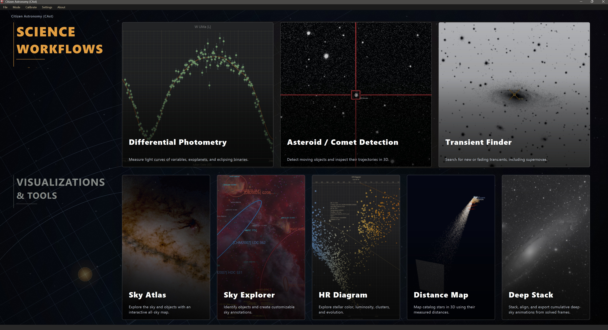
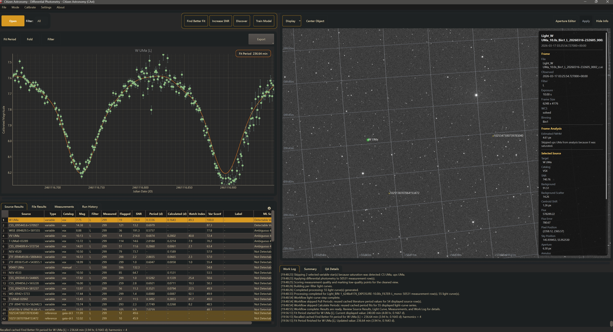
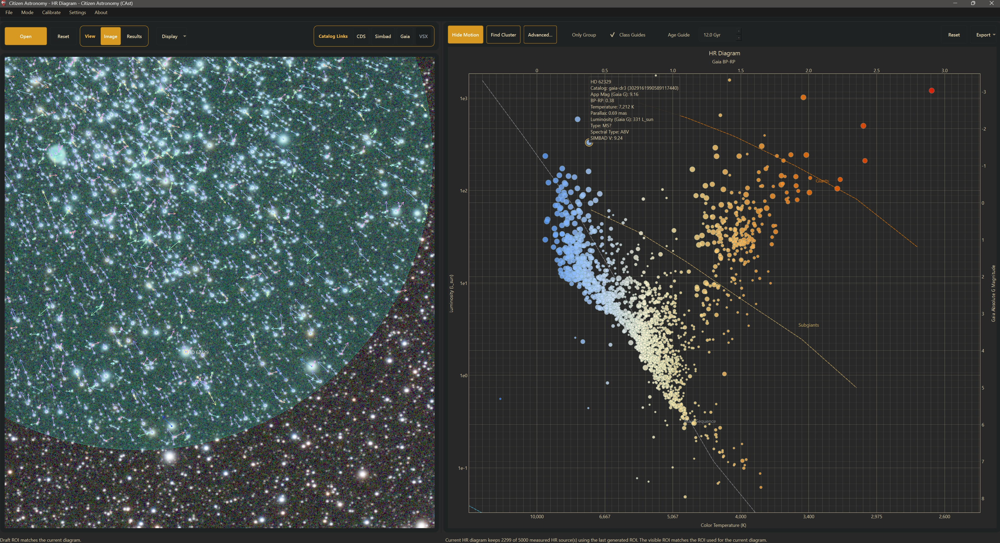

#  Citizen Astronomy (CAst)

Every clear night, amateur telescopes around the world capture photons that professional observatories never will -- the right patch of sky, at the right moment, with enough patience to notice something change. Citizen Astronomy turns those images into science.

**CAst** is a Windows desktop application that takes folders of FITS and XISF images and gives you the tools to measure variable stars, discover moving asteroids, build Hertzsprung-Russell diagrams, and explore the sky -- all from one guided interface, no command-line scripting required.



## Modes of CAst

### Differential Photometry

Open a folder of time-series images, and CAst scans your frames, identifies field stars through Gaia DR3 and VSX catalogs, performs aperture photometry with adaptive FWHM-scaled apertures, and produces differential light curves. Fit periods with Lomb-Scargle, refine comparison stars, bin for signal-to-noise, and export science-ready AAVSO reports.

A more detailed guide can be found at [Differential Photometry Guide](guides/differential_photometry.md).



### HR Diagram

Load a single deep image of a star cluster and plot a color-magnitude diagram using Gaia BP-RP photometry and absolute magnitudes. Identify co-moving stellar groups with proper-motion clustering, overlay educational class and age guides, and export publication-quality diagrams with temperature and luminosity scales.

A more detailed guide can be found at [HR Diagram Guide](guides/hr_diagram.md).



### Asteroid and Comet Detection

Point CAst at a sequence of solved frames and it queries known solar system objects predicted in your field -- including faint comets and interstellar visitors. Blink through your frames, track objects across exposures, align subframes onto a common WCS grid, and run the **Discover** pipeline to find moving objects that aren't in the catalogs yet. Confirm candidates with synthetic tracking that shifts and stacks on predicted motion. Inspect paths with **Plots**, and visualize orbits in a heliocentric **Trajectory View** built from JPL Horizons data.

A more detailed guide can be found at [Asteroid and Comet Detection Guide](guides/asteroid_comet_detection.md).

### Sky Explorer

Open any plate-solved image and turn it into an annotated field census. CAst queries SIMBAD, Gaia DR3, VSX, the NASA Exoplanet Archive, and JPL Horizons for objects inside your footprint, then overlays them on the frame with a searchable results table. Switch object-type modes from Simple deep-sky classes to Scientific SIMBAD codes, compare against DSS or Hα survey cutouts with an interactive divider, mark magnitude reach with Mag Limit, add manual annotations, and export stills or comparison animations.

A more detailed guide can be found at [Sky Explorer Guide](guides/sky_explorer.md).

### Transient Finder

Search a folder of repeated sky images for objects that vary significantly between frames. CAst solves missing plate solutions automatically, builds a shared comparison catalog, and flags candidates with real frame-to-frame variability.

A more detailed guide can be found at [Transient Finder Guide](guides/transient_finder.md).

### Deep Stack

Open a folder of related frames and turn it into a cumulative stacking animation. Deep Stack can align plate-solved images onto a common WCS grid, crop to the region you care about, track running metrics such as signal, noise, SNR, FWHM, and total integration time, and export GIF or MP4 animations with annotations and live plot overlays. 

A more detailed guide can be found at [AstroStack Guide](guides/astrostack.md).

https://github.com/user-attachments/assets/05b354d0-dbcb-4a6a-ad3d-79a4d0ed59a3


### Sky Atlas

Explore the sky as a live interactive atlas with searchable bright stars, Messier targets, constellations, and the Moon; observer-location and UTC time controls; constellation, grid, horizon, and Milky Way layers; and on-demand deep star catalogs. Sky Atlas also lets users create their **own surveys from their own sky data** by importing sky-registered PNG, XISF, TIFF, or FITS images as custom overlay surveys.

A more detailed guide can be found at [Sky Atlas Guide](guides/sky_atlas.md).

### Distance Map

Take a solved field image and turn it into a Gaia-based 3D parallax map. Distance Map filters stars by magnitude, distance, and parallax quality, visualizes the field in 3D, highlights likely co-moving groups with **Find Cluster**, and lets you inspect the same selection in the image, table, and spatial view.

A more detailed guide can be found at [Distance Map Guide](guides/distance_map.md).

## Supported inputs

- `.fit` / `.fits` (FITS)
- `.xisf` (PixInsight XISF)

Images can be plate-solved beforehand or solved on the fly through astrometry.net (API key required for unsolved images).

## Installation

**For alpha reviewers:** Download the installer from the [Releases](../../releases) page. After installation, check for updates from **File > Check for Updates** inside the app.

**For developers:**

```powershell
python -m pip install -e .
python -m photometry_app.main
```

Requires Python 3.11+. See the full dependency list in `pyproject.toml`.

## Configuration

- **Astrometry.net API key:** Set in the app Settings dialog, or via the environment variable `CITIZEN_PHOTOMETRY_ASTROMETRY_API_KEY`.
- **Observatory setup:** Telescope, camera, focal length, pixel size, location, and Bortle class can be configured in Settings and are written into exported science reports.
- **Themes:** Eight built-in dark themes (Gruvbox, Nord, Dracula, Tokyo Night, Catppuccin, Solarized Dark, One Dark, and Dark), plus custom theme editing with import/export.

## Outputs

Depending on the mode and export action, CAst can produce:

- Differential light curve CSVs and themed PNG plots
- AAVSO Extended format reports with preflight validation
- Science-ready accepted/rejected observation JSON (schema v3)
- Annotated image exports and animated GIF blink recordings
- HR diagram exports with scientific tables
- Asteroid/comet recovery benchmark CSVs and discovery summaries
- Calibrated FITS outputs with reduction manifests

## Documentation

Mode guides live under [`guides/`](guides/): [Differential Photometry](guides/differential_photometry.md), [HR Diagram](guides/hr_diagram.md), [Asteroid/Comet Detection](guides/asteroid_comet_detection.md), [Transient Finder](guides/transient_finder.md), [Sky Explorer](guides/sky_explorer.md), [AstroStack](guides/astrostack.md), [Sky Atlas](guides/sky_atlas.md), and [Distance Map](guides/distance_map.md).

Shared shell details — themes, folder layout, and common UI panels — are in [Themes, Layout, and Shared UI](guides/themes_layout_ui.md).

For a detailed map of the repository layout, modules, modes, workers, packaging, and tests, see [CODEBASE_MAP.md](CODEBASE_MAP.md).

## Status

CAst is in **alpha**. It is under active development and being distributed privately for review. Core workflows are functional but some features are still incomplete. The installer is currently unsigned -- Windows SmartScreen may show a warning on first run.

## License

This project is licensed under the [Creative Commons Attribution-NonCommercial-NoDerivatives 4.0 International](https://creativecommons.org/licenses/by-nc-nd/4.0/) license. You are free to use and share it for educational and non-commercial purposes, but you may not create derivative works or use it for commercial gain. See [LICENSE](LICENSE) for details.

Logo designed by [Ege Palaz](https://palaz.se/).
Developed by Ogetay. For more information, visit [ogetay.com/citizen-astronomy-cast](https://ogetay.com/citizen-astronomy-cast).
