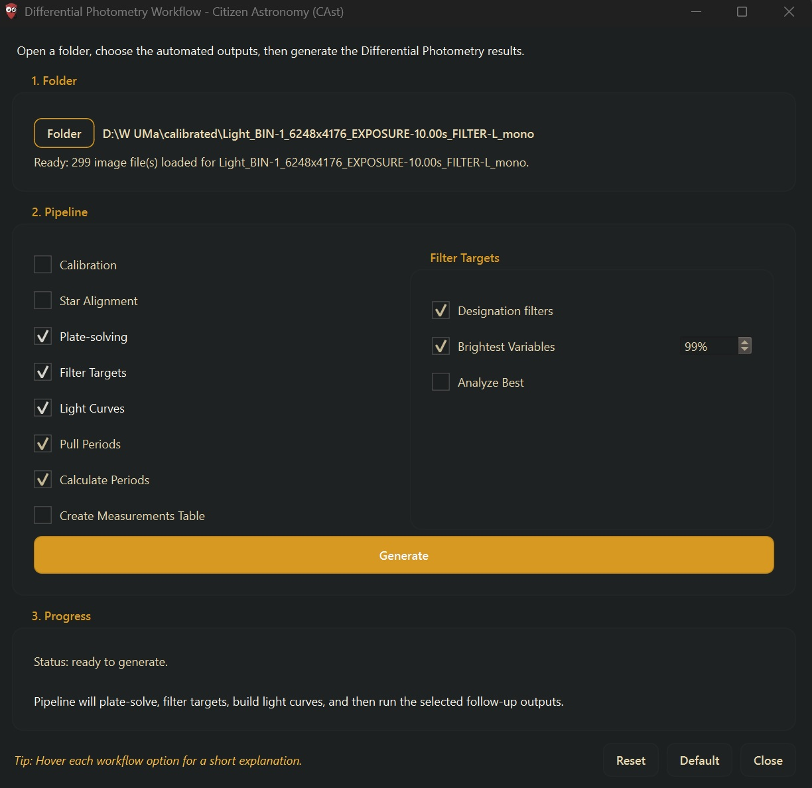

# Differential Photometry

## Introduction

Somewhere in your images, a star is changing brightness -- and you might be the first person to notice.

Differential photometry is the technique of measuring how a star's brightness changes over time by comparing it to nearby stars in the same field. Because those comparison stars share the same atmosphere, the same clouds, and the same telescope optics, most of the noise cancels out. What remains is the signal: a light curve that tells the story of what is happening to the star.

**Citizen Astronomy (CAst)** implements a complete differential photometry pipeline. You provide a folder of FITS or XISF images, and CAst handles the rest -- scanning your frames, identifying stars, measuring fluxes, selecting comparisons, computing differential magnitudes, estimating periods, and packaging your results in formats ready for the scientific community.

### What you can do with this mode

- **Measure variable stars.** Generate light curves for eclipsing binaries, pulsating stars, rotational variables, and other types of stellar variability.
- **Detect exoplanet transits.** Measure the subtle dip in a star's brightness as a planet passes in front of it.
- **Discover new variables.** CAst includes a discovery pipeline that systematically measures non-cataloged Gaia stars in your field, scores them for variability, and flags candidates that may have never been reported. You could be the one to find them.
- **Submit to AAVSO.** CAst generates AAVSO Extended Format exports with preflight validation, ready for upload to the American Association of Variable Star Observers database. Many cataloged variable stars have sparse or no observations at all. Every observation you submit fills a gap.
- **Build science-ready reports.** Full export bundles include accepted and rejected observation tables, reduction manifests, reference-star manifests, provenance records, and annotated images -- everything a reviewer or collaborator needs to evaluate your work.

### Why this matters

Professional observatories cannot watch every star, every night. Thousands of known variable stars have fewer than a handful of observations in the AAVSO International Database. Tens of thousands more have never been observed at all. And for every cataloged variable, there are unlisted stars quietly varying in brightness, waiting to be noticed by someone pointing a telescope at the right patch of sky.

Your images already contain these signals. This tool helps you extract them.

---

## How It Works

### Step 1: Image Scanning and Metadata Extraction

When you open a folder, CAst recursively scans for `.fit`, `.fits`, and `.xisf` files. For each frame it reads:

- **Observation timestamp** from `DATE-OBS` (or PixInsight's `Observation:Time:Start` / `Observation:Time:End` UTC properties when available). Naive timestamps without timezone information are interpreted using the configured Image Timestamp Timezone setting.
- **Exposure time** from `EXPTIME`, `EXPOSURE`, `EXPOSURE_TIME`, `DARKTIME`, or `EXPOSUREMS` (milliseconds, scaled by 0.001).
- **Filter** from `FILTER`.
- **WCS** (World Coordinate System) for mapping pixel coordinates to sky coordinates.
- **Saturation threshold** from header keywords (`SATURATE`, `SATLEVEL`, `DATAMAX`, etc.), falling back to bit-depth estimates (65,535 for 16-bit unsigned).

After scanning, a Loaded Results dialog lets you choose which object to analyze.

### Step 2: WCS Validation and Plate Solving

Every frame needs a valid World Coordinate System so that CAst can identify which star is which across multiple images. CAst validates the WCS by checking for `CTYPE1`/`CTYPE2` keywords containing RA/DEC projections, along with `CRVAL`, `CRPIX`, and CD or PC matrix keywords.

If a frame lacks a valid WCS, CAst can solve it through the **astrometry.net** API. The solver uploads the image with hints (center coordinates, scale bounds, parity) and retrieves the solved WCS. For large images (6000+ pixels), a 4x downsample is used to speed up the solve. Frames sharing the same alignment (e.g., PixInsight StarAlignment outputs) can share a single solved WCS.

### Step 3: Catalog Queries

Using the solved WCS, CAst queries external catalogs to identify stars in your field:

- **Gaia DR3** -- positions, magnitudes (G, BP, RP), proper motions, and parallaxes for reference star selection.
- **VSX** (AAVSO Variable Star Index) -- known variable star designations, types, periods, and magnitude ranges.
- **NASA Exoplanet Archive** -- known exoplanet host stars for transit monitoring.

Any Gaia star within 30 arcseconds of a known variable is excluded from the reference star pool.

### Step 4: Frame Calibration (Optional)

If you have calibration frames, CAst applies the standard CCD reduction formula:

$$
\text{calibrated} = \frac{\text{light} - \text{bias} - s \cdot \text{dark}}{\text{flat}_{\text{norm}}}
$$

Where:

- **Master bias** is the pixel-wise median of all bias frames.
- **Master dark** is the pixel-wise median of dark frames, bias-subtracted, and scaled by the exposure ratio: $s = t_{\text{science}} / t_{\text{dark}}$.
- **Master flat** is the pixel-wise median of flat frames, bias- and dark-subtracted, then normalized by dividing by its own median positive value. Pixels at or below zero are set to 1.0 to prevent division artifacts.

Non-finite pixels in the calibrated output are set to zero. Calibrated frames can optionally be WCS-aligned onto a common grid.

---

## The Measurement Pipeline

### FWHM Estimation

Before measuring any star, CAst estimates the seeing by measuring the Full Width at Half Maximum (FWHM) of bright stars in the frame.

**Per-star FWHM** is measured in a 15x15 pixel cutout:

1. Background is estimated using sigma-clipped statistics (3-sigma clipping).
2. The stellar signal is isolated above a threshold of max(3% of peak, 1.5x background scatter).
3. A signal-weighted centroid is computed within the cutout.
4. **Primary method (radial profile):** Pixel values are binned by radial distance from the centroid in 0.5-pixel steps. The radius where the median annular signal drops below half the peak is found by linear interpolation. FWHM = 2x that radius.
5. **Fallback (second moments):** If the radial profile method fails, weighted second moments are computed, and FWHM = 2.355 x sigma (the Gaussian conversion constant $2\sqrt{2 \ln 2}$).

Only values between 0.8 and 14 pixels are accepted.

**Per-frame FWHM** is the median of individual measurements from up to 24 of the brightest stars in the frame.

### Aperture Photometry

CAst uses circular aperture photometry, implemented with `photutils`. Two sizing modes are available:

**Fixed mode** uses pixel-valued radii directly:

| Parameter       | Default |
| --------------- | ------- |
| Aperture radius | 5.0 px  |
| Inner annulus   | 8.0 px  |
| Outer annulus   | 12.0 px |

**FWHM-scaled mode** (recommended) adapts apertures to the measured seeing:

| Parameter       | Default scale |
| --------------- | ------------- |
| Aperture radius | 1.6x FWHM     |
| Inner annulus   | 3.0x FWHM     |
| Outer annulus   | 4.5x FWHM     |

Minimum separations are enforced: the inner annulus is at least 1 pixel larger than the aperture, and the outer annulus is at least 1 pixel larger than the inner.

#### Flux Extraction

For each star in each frame:

1. **Centroid recentering:** The star's position is refined using a signal-weighted centroid within a local cutout. The shift is capped at 8 pixels from the WCS-predicted position.
2. **Aperture sum:** A `CircularAperture` is placed at the recentered position and the total pixel signal is summed.
3. **Sky background:** A `CircularAnnulus` is placed around the star. The annulus pixels are sigma-clipped (3-sigma) and the **median** of the remaining pixels is taken as the local sky background per pixel.
4. **Background subtraction:**

$$
F = S_{\text{aperture}} - \tilde{B} \cdot A_{\text{aperture}}
$$

Where $S_{\text{aperture}}$ is the raw aperture sum, $\tilde{B}$ is the sigma-clipped median background, and $A_{\text{aperture}}$ is the aperture area in pixels.

1. **Instrumental magnitude:**

$$
m_{\text{inst}} = -2.5 \log_{10}(F)
$$

### Comparison Star Selection

Good comparison stars are critical. CAst selects them automatically from the Gaia DR3 catalog:

- **Magnitude range:** 8.0 to 16.0 (configurable), with preference for 10.0 to 13.5 -- bright enough for good signal, faint enough to avoid saturation.
- **Ideal magnitude:** 11.5 (closest to the midpoint of the preferred range gets priority).
- **Variable exclusion:** Any star within 30 arcseconds of a known VSX variable is excluded.
- **Maximum count:** Up to 25 reference stars are selected per field.

For each measurement of the target star, the **5 nearest** comparison stars (by sky distance) are used. Their fluxes are combined using inverse-variance weighting:

$$
F_{\text{ref}} = \frac{\sum_i w_i  F_i}{\sum_i w_i}, \quad w_i = \frac{1}{\sigma_{F_i}^2}
$$

This ensemble approach minimizes the noise contribution from any single comparison star. If no valid flux errors are available, an unweighted median is used as a fallback.

Manual mode allows you to explicitly designate which stars serve as target, comparison, or check, with individually configurable aperture radii.

### Differential Magnitude

The differential magnitude is computed as:

$$
\Delta m = -2.5 \log_{10}\left(\frac{F_{\text{target}}}{F_{\text{ref}}}\right)
$$

This is the core measurement. Because both the target and comparison stars are observed through the same atmosphere at the same time, first-order atmospheric extinction cancels out. Thin clouds, haze, and transparency variations affect all stars equally and divide away.

### Zero-Point Calibration

When comparison stars have known catalog magnitudes (from Gaia DR3), CAst can compute a photometric zero point:

$$
\text{ZP} = m_{\text{catalog}} - m_{\text{inst}}
$$

If multiple reference stars have catalog magnitudes with valid uncertainties, the zero point is an **inverse-variance weighted average**. Otherwise, the **median** is used. The calibrated magnitude is:

$$
m_{\text{cal}} = m_{\text{inst}} + \text{ZP}
$$

When a zero point is available, the AAVSO export uses `MTYPE=STD` (standard). Otherwise, it falls back to `MTYPE=DIF` (differential).

---

## Uncertainty and Error Analysis

CAst computes a complete error budget for every measurement. The total uncertainty combines three independent components in quadrature:

$$
\sigma_{\text{total}} = \sqrt{\sigma_{\text{CCD}}^2 + \sigma_{\text{empirical}}^2 + \sigma_{\text{scintillation}}^2}
$$

### CCD Noise Model

The theoretical flux error follows the standard CCD equation:

$$
\sigma_F = \sqrt{S \cdot g + n_{\text{ap}} \cdot \left( B_{\text{sky}} \cdot g + D \cdot t + R^2 \right) + \frac{n_{\text{ap}}^2}{n_{\text{sky}}} \cdot \left( B_{\text{sky}} \cdot g + D \cdot t + R^2 \right)}
$$

Where:

- $S \cdot g$ = source photon noise (flux times gain, in electrons)
- $B_{\text{sky}} \cdot g$ = sky background noise (per pixel, in electrons)
- $D \cdot t$ = dark current noise (dark current rate times exposure time)
- $R^2$ = readout noise variance (read noise in electrons, squared)
- $n_{\text{ap}}$ = number of pixels in the aperture
- $n_{\text{sky}}$ = number of pixels in the sky annulus

The third term accounts for uncertainty in the background estimate itself -- the finite number of sky pixels means the background level is measured with some noise, and this propagates into every aperture measurement.

If gain is specified in ADU, the result is divided by gain to convert back to flux units.

### Magnitude Error Conversion

Flux error is converted to magnitude error using the standard propagation:

$$
\sigma_m = \frac{2.5}{\ln 10} \cdot \frac{\sigma_F}{F} \approx 1.0857 \cdot \frac{\sigma_F}{F}
$$

### Differential Magnitude Error

The error on the differential magnitude combines the target and reference uncertainties:

$$
\sigma_{\Delta m} = \frac{2.5}{\ln 10} \cdot \sqrt{\left(\frac{\sigma_{F_{\text{target}}}}{F_{\text{target}}}\right)^2 + \left(\frac{\sigma_{F_{\text{ref}}}}{F_{\text{ref}}}\right)^2}
$$

### Scintillation

Atmospheric scintillation (twinkling) adds noise that the CCD equation does not capture. CAst estimates it using the Young approximation:

$$
\sigma_{\text{scint}} = \frac{0.09 \cdot D^{-2/3} \cdot X^{1.75} \cdot e^{-h/8000}}{\sqrt{2t}} \cdot \sqrt{1 + \frac{1}{N_{\text{comp}}}}
$$

Where $D$ is the telescope aperture in cm, $X$ is the airmass, $h$ is the observatory altitude in meters, $t$ is the exposure time in seconds, and $N_{\text{comp}}$ is the number of comparison stars. The last factor accounts for scintillation in the comparison ensemble.

### Empirical Scatter

Real data often has noise sources not captured by theory (tracking errors, flat-field residuals, focus drift). CAst estimates this from the data itself using a robust MAD (Median Absolute Deviation) estimator with iterative 4-sigma clipping:

$$
\sigma_{\text{empirical}} = 1.4826 \cdot \text{median}\left(|x_i - \tilde{x}|\right)
$$

The factor 1.4826 scales the MAD to be consistent with the standard deviation of a Gaussian distribution.

---

## Quality Assurance

Every measurement passes through a multi-criterion quality analysis. Each starts with a quality score of 1.0, which is reduced by penalties:

| Check                         | Threshold         | Penalty             |
| ----------------------------- | ----------------- | ------------------- |
| Low SNR                       | < 5               | -0.18               |
| Very low SNR                  | < 3               | **Excluded**        |
| Centroid shift                | > 2.5 px          | -0.10               |
| Large centroid shift          | > 4.0 px          | **Excluded**        |
| Comparison scatter            | > 8%              | -0.15               |
| Extreme comparison scatter    | > 18%             | **Excluded**        |
| Global outlier (MAD)          | z > 4.5           | -0.28, **Excluded** |
| Local outlier (Hampel filter) | z > 4.5, window=2 | -0.28, **Excluded** |
| Saturated pixels              | Any               | **Excluded**        |
| Non-positive flux             | Any               | **Excluded**        |
| Quality score below floor     | < 0.35            | **Excluded**        |

Outlier detection uses a robust z-score: $z = |x - \tilde{x}| / (1.4826 \cdot \text{MAD})$. The Hampel filter applies this locally in a sliding window to catch isolated bad points without biasing the global statistics.

Near-saturation is flagged at 95% of the saturation threshold.

### Check Star Validation

When check stars are available (a star with a known magnitude that is treated as if it were a variable), CAst computes per-frame check residuals:

$$
\Delta_{\text{check}} = m_{\text{check,calibrated}} - m_{\text{check,catalog}}
$$

and the per-series RMS of those residuals. This provides an independent assessment of the photometric accuracy: if your check star shows a stable residual RMS of 0.01 mag, your measurements of the target are likely accurate to a similar level.

---

## Period Analysis

CAst includes three period-detection methods:

### Generalized Lomb-Scargle (GLS)

The default astronomical periodogram for unevenly sampled data. CAst uses `astropy.timeseries.LombScargle.autopower()` with 10 samples per peak. The frequency with the highest power is selected, and subharmonic frequencies (at 1/2, 1/3, 1/4 of the detected frequency) are tested and promoted if they produce a better fit.

### Harmonic Fit (Default Method)

A more thorough search that fits a truncated Fourier series at each candidate period:

$$
f(t) = a_0 + \sum_{k=1}^{K} \left[ a_k \cos\left(\frac{2\pi k  t}{P}\right) + b_k \sin\left(\frac{2\pi k  t}{P}\right) \right]
$$

with up to $K = 6$ harmonics. The search proceeds in three stages:

1. **Coarse scan:** 240 logarithmically spaced candidate periods.
2. **Refinement:** Three progressively narrower windows around the best candidate, each testing 180-200 periods.
3. **Subharmonic check:** Periods at 2x, 3x, and 4x the best candidate are tested and accepted if they reduce the BIC (Bayesian Information Criterion).

The best period is selected by residual score, and eclipsing binary convention (doubled period) is tested with a BIC tolerance of 6.0.

### Box Least Squares (BLS)

Optimized for detecting flat-bottomed transits and eclipses. Uses `astropy.timeseries.BoxLeastSquares.autopower()` with a frequency factor of 8 and a grid of trial durations. Returns both the orbital period and the eclipse/transit duration. Harmonics at 2x, 3x, and 4x are also tested.

### Search Bounds

The minimum search period is the larger of the user-configured minimum and twice the median observing cadence. The maximum is the smaller of the user-configured maximum and 95% of the total time span. Results that fall within 0.5% of either search boundary are rejected as unreliable.

---

## Light Curve Fitting

After a period is determined, CAst can overlay a fit curve for visual interpretation.

### Polynomial Fit

Fits a polynomial of configurable degree (default 3) with robust iterative re-weighting (Huber-style, 4 iterations). The time axis is centered and normalized to prevent numerical instability.

### Periodic Fit

Fits a Fourier series at the determined period (default 2 harmonics, up to 6). Coefficients are solved using robust weighted linear least squares. This is the natural fit for periodic variables.

---

## Variable Star Discovery

The **Discover** action systematically searches for unreported variable stars among the non-cataloged Gaia stars in your field. For each candidate:

1. The star is measured across all frames as if it were a variable target.
2. An optimized comparison star subset is selected.
3. A differential light curve is constructed.
4. Variability metrics are computed:
  - **Reduced chi-squared** -- how much the light curve deviates from a constant.
  - **MAD** (Median Absolute Deviation) -- robust scatter measure.
  - **Amplitude** -- the 5th to 95th percentile brightness range.
  - **Stetson J index** -- a correlated-variability statistic that rewards pairs of consecutive measurements that deviate together.
  - **Stetson K index** -- measures the kurtosis of the magnitude distribution.
  - **Von Neumann ratio** -- sensitive to smooth versus erratic variations.
5. These metrics are combined into a **candidate score** (0 to 100) via weighted contributions.

A trained **Random Forest classifier** (160 trees, balanced class weighting) can also score candidates if you have labeled previous examples as real or artifact. Labels and feature vectors are stored in a local database, and the model retrains as you label more candidates.

High-scoring candidates may represent genuinely unreported variable stars. Cross-check them against VSX and the literature before claiming a discovery.

---

## AAVSO Export

CAst generates an AAVSO Extended Format text file, the standard for submitting observations to the AAVSO International Database.

### Format

The export writes a comma-delimited file with 15 columns:

`NAME, DATE, MAG, MERR, FILT, TRANS, MTYPE, CNAME, CMAG, KNAME, KMAG, AMASS, GROUP, CHART, NOTES`

- **DATE** is the Julian Date at mid-exposure (observation time + half the exposure duration).
- **MTYPE** is `STD` when a zero-point calibration is available, `DIF` otherwise.
- **TRANS** is `YES` only when MTYPE is STD and the user has flagged their data as transformed.
- **FILT** is mapped from ~60 recognized filter aliases (Johnson, Sloan, clear, etc.) to AAVSO codes. Unrecognized filters default to code `O`.
- **NOTES** include instrumental magnitudes, comparison reference magnitudes, and zero-point metadata as AAVSO sub-fields.

### Airmass

Airmass is read from header keywords (`AIRMASS`, `SECZ`, `SECAIRM`). If absent, CAst computes a geometric estimate:

$$
X = \sec(z)
$$

where $z$ is the zenith distance, computed by transforming the target's RA/Dec to the local altitude-azimuth frame at the observation time using the configured observatory coordinates (latitude, longitude, elevation).

### Preflight Validation

Before the export file is written, a preflight JSON report is generated listing:

- Whether observer code and chart ID are present.
- How many rows are STD versus DIF.
- Warnings for missing airmass, unrecognized filter codes, missing observer code, etc.
- Skipped measurements with reasons.

This lets you review potential issues before uploading to AAVSO.

---

## SNR Binning

The **Increase SNR** action temporally bins adjacent measurements to improve the signal-to-noise ratio, trading time resolution for precision. This is useful for faint targets or noisy data.

### How it works

1. Measurements are sorted chronologically.
2. The variability type is classified as **sharp** (eclipsing binaries, RR Lyrae, delta Scuti, transits) or **smooth** (rotational, semi-regular, sinusoidal).
3. A maximum bin duration is computed from the period to avoid smearing real variability:
  - Sharp variables: 1.5% of the period.
  - Smooth variables: 5% of the period.
  - Default: 3% of the period.
  - Absolute cap: 600 seconds.
4. The target number of frames per bin is estimated from the SNR deficit: $n = \lceil (\text{target SNR} / \text{median SNR})^2 \rceil$, capped at 15.
5. Frames within each bin are combined using inverse-variance weighted flux averaging, with optional 3.5-sigma MAD clipping to reject outliers within the bin.

**Reset SNR** restores the original unbinned data from a cached copy.

---

## Export Bundle

A full `File > Export Report` produces a comprehensive science bundle:

| File                                 | Contents                                             |
| ------------------------------------ | ---------------------------------------------------- |
| `_measurements.csv`                  | Raw per-frame photometry (28 columns)                |
| `_light_curves.csv`                  | Time-ordered differential magnitudes per series      |
| `_accepted_observations.csv / .json` | Science-ready rows (51-field schema v3)              |
| `_rejected_observations.csv / .json` | Excluded rows with rejection reasons                 |
| `_reference_manifest.csv`            | Per-reference-star usage, magnitudes, saturation     |
| `_reduction_manifest.json`           | Observation metadata, aperture settings, star counts |
| `_provenance_manifest.json`          | File paths, calibration states, comparison methods   |
| `_aavso_extended.txt`                | AAVSO upload file                                    |
| `_aavso_preflight.json`              | Pre-upload validation report                         |
| `_plots/`                            | Light curve PNGs in the current theme                |
| `_annotated_images/`                 | Field images with aperture overlays                  |

---

## Limitations

### What differential photometry does not do

- **Absolute photometry.** Without photometric standard fields observed at multiple airmasses, the zero point is approximate. The calibration relies on Gaia catalog magnitudes, which are in the Gaia photometric system and may not match your filter precisely.
- **Atmospheric extinction correction.** First-order extinction cancels in the differential, but second-order (color-dependent) extinction is not modeled. For wide-band filters on targets with extreme colors, this can introduce systematic errors at the ~0.01 mag level.
- **Transformation to standard systems.** The export supports a `TRANS` flag, but CAst does not yet compute color transformation coefficients. True transformed photometry requires standard field observations.
- **Crowded-field photometry.** Aperture photometry works well in uncrowded fields but struggles when stars overlap. PSF-fitting photometry, which models the point-spread function to deblend overlapping sources, is not implemented.
- **Sub-millimagnitude precision.** For bright, well-measured stars, systematic effects (flat-field residuals, fringing, intra-pixel sensitivity) become the dominant noise source. CAst does not model these.

### What could be improved

- **PSF photometry** for crowded fields and faint targets where aperture photometry wastes signal.
- **Color transformation** to place measurements on a standard photometric system (Johnson-Cousins, Sloan).
- **Differential extinction correction** using measured color terms and airmass.
- **Ensemble photometry weighting** using star-by-star stability metrics rather than inverse-variance flux weighting alone.
- **Automated variability classification** beyond the current scoring metrics -- light curve shape classification using template matching or neural networks.
- **Multi-night trending** to detect long-period variables and secular brightness changes across observing sessions.

---

## Conclusion

Differential photometry is one of the most accessible and scientifically productive techniques available to amateur astronomers. With a modest telescope, a CCD or CMOS camera, and patience, you can produce measurements that contribute to our understanding of stellar physics, binary star orbits, exoplanet atmospheres, and the discovery of objects no one has cataloged before.

CAst is designed to lower the barrier between capturing images and doing science with them. The algorithms are grounded in established photometric methods. The exports speak the language of professional databases. And the discovery pipeline offers a systematic way to search for the unknown in data you already have.

Every light curve begins with someone deciding to look.