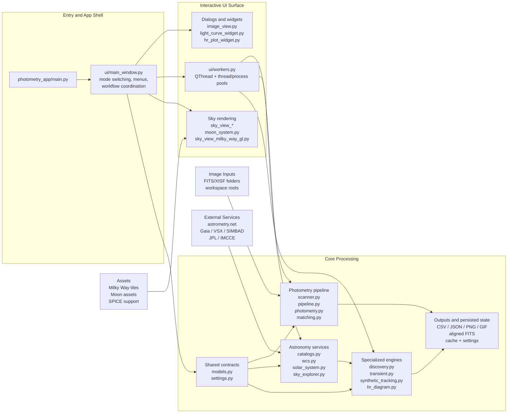

# Citizen Photometry Codebase Map (Printable)

Print recommendation: landscape orientation on Letter or A4 paper, with "fit to page width" enabled.

Scope of this map: primary product code and support material under `photometry_app/`, `tests/`, `scripts/`, `docs/`, and `assets/`.

Excluded from the architectural view: `.venv/`, benchmark result folders, temporary shipping artifacts, and other generated or vendored content that would reduce print readability without adding design insight.

## Executive Summary

Citizen Photometry is a Windows-first PySide6 desktop application for astrophotography analysis. Architecturally, it is best understood as a mode-driven desktop shell wrapped around a large domain-heavy `core` package. The project is not a small GUI on top of a thin backend; most of the repository's real complexity lives in astronomy, imaging, catalog, and workflow logic, with the desktop UI acting as an orchestration layer across many specialized modes.

The single most important structural fact is that `photometry_app/ui/main_window.py` is the central coordinator. It wires together the main window, menus, workflow state, rendering surfaces, and feature entry points for the app's seven major modes: Differential Photometry, HR Diagram, Asteroid/Comet Detection, Astrostack, Transient Finder, Sky View, and Sky Explorer. If a reader wants to understand how features are surfaced to the user, this is the first file to read after the entry point.

The `photometry_app/core/` package contains most of the system's domain behavior. It covers file scanning, WCS validation and plate-solving integration, catalog lookup, photometric measurement, matching and light-curve generation, report export, solar-system queries, moving-object discovery, transient search, synthetic tracking, calibration, alignment, and HR-diagram analysis. Shared data contracts and enums live in `core/models.py`, while persisted workspace and application configuration live in `core/settings.py`.

The main separation between interactive UI and expensive work is `photometry_app/ui/workers.py`. That file acts as the background execution boundary for long-running CPU-heavy and network-heavy tasks, using Qt threads plus Python thread/process pools to keep the GUI responsive while photometry, catalog, discovery, export, and search jobs run.

From a maintenance perspective, this is a broad but understandable monolith. The codebase is partitioned into meaningful subsystems, but the central UI shell imports deeply across them, so coupling is highest at the top of the application. The project is supported by a substantial test surface, targeted developer scripts, and asset/documentation directories that reinforce the main runtime package rather than replacing it.

High-level conclusion: for architecture discussions, treat the repository as a desktop application shell with three main layers: UI surfaces, async orchestration, and astronomy-processing engines.

## Architecture Diagram

The Mermaid diagram below is intentionally collapsed to subsystem level so it remains readable when printed in landscape format.

### Diagram Notes

- `ui/main_window.py` is the orchestration hub, not merely a frame around independent tools.
- `ui/workers.py` is the execution boundary that prevents astronomy and export work from blocking the GUI thread.
- `core/models.py` and `core/settings.py` provide the shared contract layer used across nearly every major subsystem.
- External services are concentrated in the astronomy-service layer rather than scattered evenly across the UI.
- Rendering-heavy features such as Sky View and Moon/Milky Way visualization have a distinct asset-backed path.

## Module Counts

Counts below are file counts from the repository's primary source and support directories.

| Area | Count | Notes |
| --- | ---: | --- |
| `photometry_app/core` | 36 Python files | Main astronomy, photometry, export, and workflow engines |
| `photometry_app/ui` | 19 Python files | Main window, dialogs, widgets, rendering, and background workers |
| `photometry_app` package root | 3 Python files | `main.py`, `app_metadata.py`, `__init__.py` |
| `photometry_app` total | 58 Python files | Full runtime package, including `core`, `ui`, and package root |
| `tests` | 49 test files | Broad `unittest` coverage across UI and core areas |
| `scripts` | 14 Python files | Benchmarking, asset generation, docs, and smoke-test helpers |
| `docs` | 10 Markdown files | Product, moon-rendering, audit, and paper support docs |
| `assets` | 5 visible tracked files | Asset manifests and READMEs for moon tiles and SPICE support |
| Major app modes | 7 | Defined in `core/models.py` via `AppMode` |

## Key Files

| File | Why it matters |
| --- | --- |
| `photometry_app/main.py` | Qt startup entry point, application setup, crash handling, and `MainWindow` launch |
| `photometry_app/ui/main_window.py` | Central coordinator for modes, menus, workflow state, and most feature integration |
| `photometry_app/ui/workers.py` | Background execution layer for expensive photometry, search, export, and catalog jobs |
| `photometry_app/core/models.py` | Shared enums and dataclasses that define the app's common language |
| `photometry_app/core/settings.py` | Persisted app/workspace configuration and many feature-specific settings |
| `photometry_app/core/pipeline.py` | Main photometry processing backbone and workflow assembly |
| `photometry_app/core/scanner.py` | File discovery and image-tree scanning |
| `photometry_app/core/photometry.py` | Aperture measurement and source-measurement mechanics |
| `photometry_app/core/matching.py` | Reference-star selection, differential photometry, and light-curve series building |
| `photometry_app/core/exporters.py` | Processing-report, plot, and image export paths |
| `photometry_app/core/catalogs.py` | Catalog-service integration and lookup support |
| `photometry_app/core/wcs.py` | WCS validation, field extraction, and astrometry integration |
| `photometry_app/core/solar_system.py` | Known-object visibility, measurement, and heliocentric context logic |
| `photometry_app/core/discovery.py` | Moving-object discovery and recovery logic |
| `photometry_app/core/transient.py` | Repeated-frame transient search workflow |
| `photometry_app/core/synthetic_tracking.py` | Shift-and-stack style detection support for faint moving objects |
| `photometry_app/ui/sky_view_milky_way_gl.py` | Specialized OpenGL rendering path for the Sky View Milky Way layer |
| `photometry_app/ui/moon_system.py` | Moon visualization/rendering subsystem and related supporting models |

## Subsystem Summary

### 1. Entry and Shell

The runtime starts in `photometry_app/main.py`, which configures Qt application attributes, performs startup cleanup, and launches `MainWindow`. The shell then centralizes mode selection, menu actions, theme/application state, and most feature entry points in `photometry_app/ui/main_window.py`.

### 2. UI Surface

The `photometry_app/ui/` package contains the visible desktop surface: dialogs, annotation and image panels, light-curve and HR widgets, label dialogs, level controls, and specialized sky-view rendering files. This layer is broad because the product supports multiple astronomy workflows in one desktop frame.

### 3. Async Boundary

`photometry_app/ui/workers.py` is the main "keep the GUI responsive" layer. It coordinates background jobs and bridges the UI to heavy computation, catalog calls, and export work.

### 4. Shared Contracts

`photometry_app/core/models.py` defines the shared domain vocabulary: modes, WCS state, scan results, photometry measurements, and other app-wide data carriers. `photometry_app/core/settings.py` persists both global and workflow-specific settings, making it the other key cross-cutting file.

### 5. Photometry Backbone

The base image-analysis path is spread across `scanner.py`, `pipeline.py`, `photometry.py`, `matching.py`, `plotting.py`, and `exporters.py`. Together these files implement scan, solve/validate, measure, compare, summarize, and export.

### 6. Astronomy Services and Specialized Engines

Catalog and field intelligence live primarily in `catalogs.py`, `wcs.py`, `solar_system.py`, and `sky_explorer.py`. More advanced workflows then build on top of that foundation in `discovery.py`, `transient.py`, `synthetic_tracking.py`, `hr_diagram.py`, `alignment.py`, and `calibration.py`.

## Suggested Reading Order

For a new maintainer or reviewer, the fastest high-value reading order is:

1. `README.md`
2. `photometry_app/main.py`
3. `photometry_app/ui/main_window.py`
4. `photometry_app/ui/workers.py`
5. `photometry_app/core/models.py`
6. `photometry_app/core/settings.py`
7. `photometry_app/core/pipeline.py`
8. Then branch into `catalogs.py`, `wcs.py`, `solar_system.py`, `discovery.py`, `transient.py`, or `sky_view_*` depending on the feature area of interest

## Notes for Reviewers

- This map is intended for print readability, so it describes subsystem-level relationships rather than every import edge.
- The runtime package is the architectural center; tests, scripts, docs, and assets are supporting structures.
- The strongest coupling point in the codebase is the main window layer, which coordinates many otherwise sensible subsystems.
- No application source code was modified to create this document.
